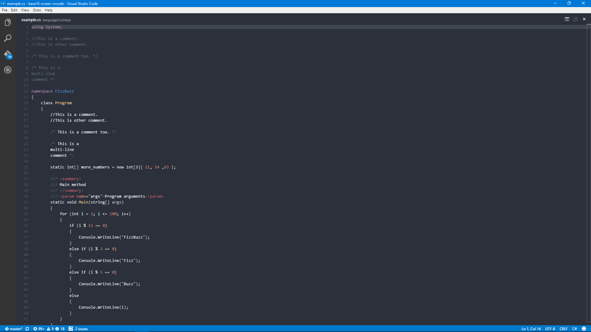

# base16-ocean-vscode

Base16 Ocean for Visual Studio Code  
(But better than the default Base16 Ocean)

## Why
Syntax highlighting is worse for some languages (I noticed it for C# and Java) when using the default tmTheme. This package makes it better.

### Dark
Before

After

### Light
Before

## VSCode Built-In Languages
#### (sourced from src/vs/editor/standalone-languages/all.ts and bundled VSCode themes)
### Name (id) - .extensions
Batch (bat) - .bat, .cmd  
C (c) - .c, .h  
Clojure (clojure) - .clj, .cljs, .cljx, .clojure, .edn  
CoffeeScript (coffeescript) - .coffee  
C++ (cpp) - .cpp, .cc, .cxx .hpp .hh .hxx  
C# (csharp) - .cs, .csx  
CSS (css) - .css  
Docker (dockerfile) - .dockerfile  
F# (fsharp) - .fs, .fsi, .ml, .mli, .fsx, .fsscript  
Go (go) - .go  
Groovy (groovy) - .groovy, .gvy, .gradle  
Handlebars (handlebars) - .handlebars, .hbs  
HTML (html) - .html, .htm, .shtml, .mdoc, .jsp, .asp, .aspx, .jshtm   
INI (ini) - .ini, .properties, .gitconfig  
Java (java) - .java, .jav  
JavaScript (javascript) - .js, .es6  
JSON (json) - .json, .bowerrc, .jshintrc, .jscsrc, .eslintrc  
Less (less) - .less  
Lua (lua) - .lua  
Makefile (makefile) - Makefile, .makefile, GNUmakefile, OCamlMakefile  
Markdown (markdown) - .md, .markdown, .mdown, .mkdn, .mkd, .mdwn, .mdtxt, .mdtext  
Objective-C (objective-c) - .m  
Perl (perl) - .pl, .pm, .pod, .t, .PL, .psgi  
PHP (php) - .php, .phtml, .ctp  
PowerShell (powershell) - .ps1, .psm1, .psd1  
Python (python) - .py, .rpy, .pyw, .cpy, .gyp, .gypi  
R (r) - .r, .rhistory, .rprofile, .rt  
Razor (razor) - .cshtml  
Ruby (ruby) - .rb, .rbx, .rjs, .gemspec, .pp  
Rust (rust) - .rs  
Sass (sass) - .scss  
ShaderLab (shaderlab) - .shader, .cginc  
Shell Script (Bash) (shellscript) - .sh, .bash, .bashrc, .bash_profile, .bash_login, .profile, .bash_logout, .zsh, .zshrc  
SQL (sql) - .sql  
Swift (swift) - .swift  
TypeScript (typescript) - .ts  
Visual Basic (vb) - .vb  
XML (xml) - .xml, .dtd, .ascx, .csproj, .config, .wxi, .wxl, .wxs, .xaml, .svg, .svgz  
YAML (yaml) - .eyaml, .eyml, .yaml, .yml  

## Example sources
Most examples were taken from RosettaCode  
[Comments](http://rosettacode.org/wiki/Comments)  
[Classes](http://rosettacode.org/wiki/Classes)  
[FizzBuzz](http://rosettacode.org/wiki/FizzBuzz)  
[Generic Swap](http://rosettacode.org/wiki/Generic_swap)  
[Arrays](http://rosettacode.org/wiki/Arrays)  
[Documentation](http://rosettacode.org/wiki/Documentation)  
[File input/output](http://rosettacode.org/wiki/File_input/output) for import/using/require